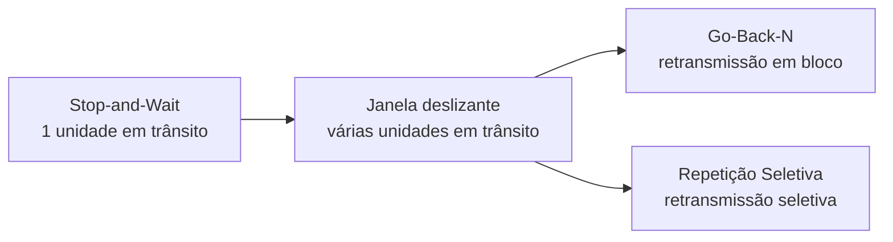

# Introdução

Protocolos de **janela deslizante** permitem que um transmissor mantenha várias unidades de dados em trânsito antes de receber todas as confirmações correspondentes. A técnica evita que o transmissor permaneça ocioso aguardando uma confirmação após cada transmissão e constitui uma ideia fundamental para compreender confiabilidade, retransmissão e controle de fluxo em redes de computadores.

Neste material, a evolução será apresentada em três etapas:

1. **Stop-and-Wait** — envia uma unidade e espera sua confirmação;
2. **Go-Back-N (GBN)** — permite várias unidades pendentes, mas uma perda pode provocar a retransmissão da unidade perdida e das posteriores;
3. **Repetição Seletiva (Selective Repeat, SR)** — permite várias unidades pendentes e reenvia somente as unidades que precisam ser recuperadas.

> **Ideia central:** a janela define quantas unidades podem estar simultaneamente em trânsito sem confirmação.
