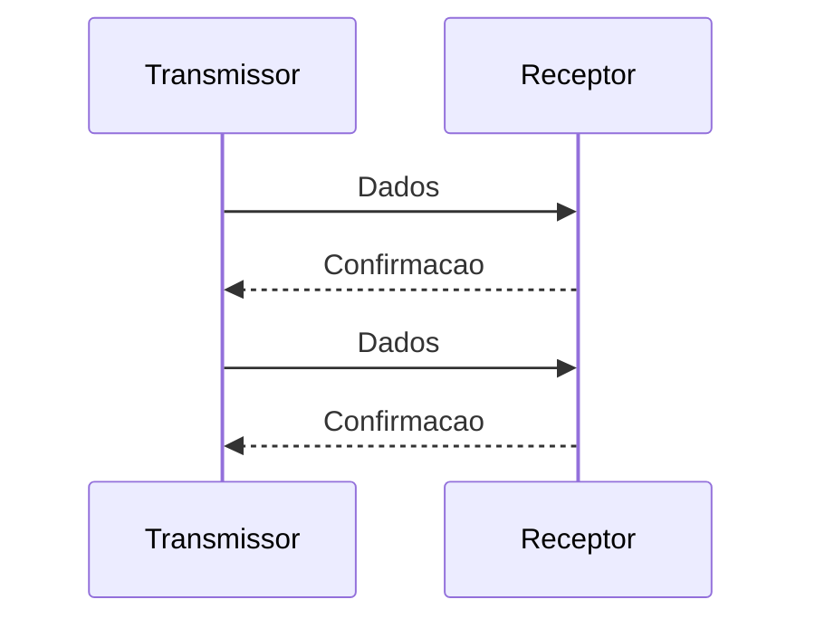
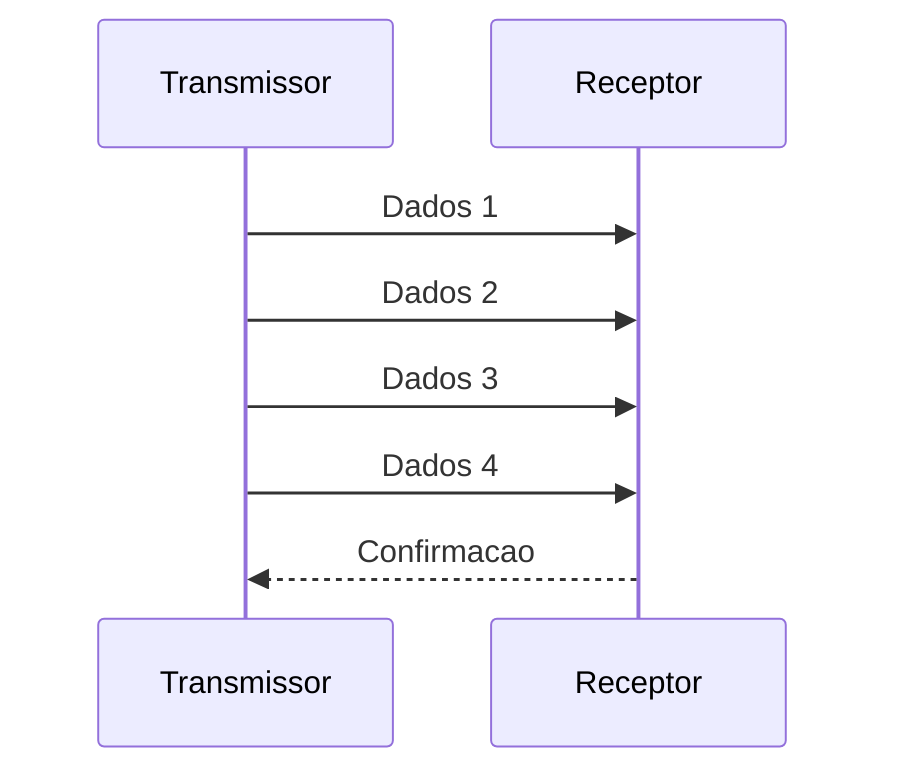

# Relação com eficiência do enlace

Considere um enlace no qual o tempo de ida e volta é grande em relação ao tempo necessário para transmitir um quadro.

Stop-and-Wait:

Janela deslizante:

A segunda estratégia permite sobrepor transmissão e espera por confirmações, mantendo mais dados em trânsito.
