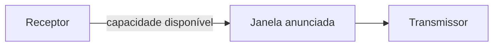

# Relação com controle de fluxo

A ideia de janela também aparece no **controle de fluxo**. O receptor pode limitar a quantidade de dados que o transmissor mantém em trânsito para evitar que seus buffers sejam excedidos.

No TCP, a janela de recepção é representada conceitualmente por **`rwnd`**. Ela expressa uma limitação associada à capacidade do receptor.
