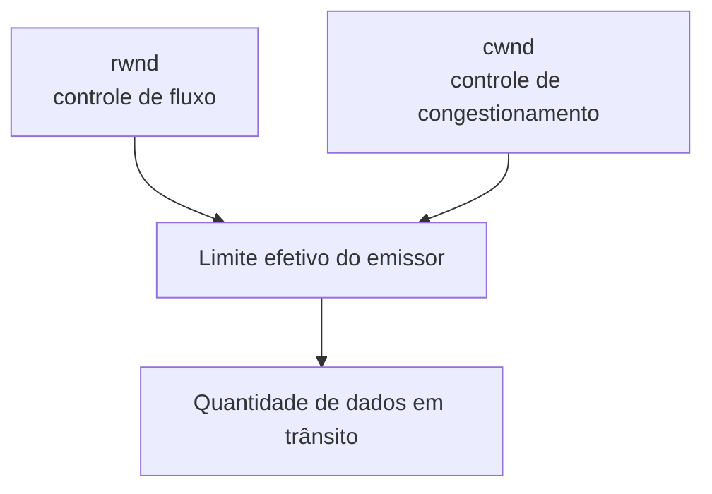

# 12. Relação com controle de congestionamento

No TCP existe outra limitação importante: a rede pode não suportar uma quantidade arbitrariamente grande de dados em trânsito. O controle de congestionamento utiliza **`cwnd`** para limitar a quantidade de dados que o emissor coloca na rede em função das condições de congestionamento.

Uma visão conceitual simplificada é:

> **Atenção:** `rwnd` e `cwnd` têm funções diferentes. O primeiro está relacionado ao receptor; o segundo, às condições da rede.
