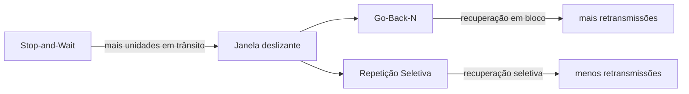

# Comparação

| Característica | Stop-and-Wait | Go-Back-N | Repetição Seletiva |
| --- | --- | --- | --- |
| Unidades simultaneamente em trânsito | 1 | Várias | Várias |
| Janela | Efetivamente 1 | Sim | Sim |
| Recuperação de perda | Unidade pendente | Perda e posteriores necessários | Somente unidades necessárias |
| Recepção fora de ordem | Não é necessária | Geralmente não aproveitada | Pode ser armazenada |
| Complexidade | Baixa | Intermediária | Maior |
| Armazenamento no receptor | Pequeno | Menor | Maior |

A evolução pode ser resumida assim:

