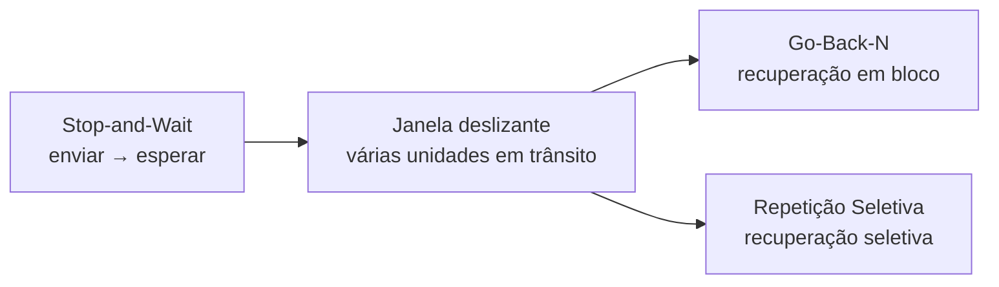

# 17. Síntese

A ideia fundamental da janela deslizante é permitir que **várias unidades de dados permaneçam em trânsito simultaneamente**, em vez de interromper a transmissão depois de cada unidade.

O **Stop-and-Wait** representa o caso mais simples: uma unidade é transmitida e o emissor aguarda sua confirmação.

O **Go-Back-N** amplia o paralelismo, mas pode precisar retransmitir a unidade perdida e unidades posteriores.

A **Repetição Seletiva** permite uma recuperação mais seletiva: unidades recebidas corretamente podem ser preservadas, enquanto somente as que precisam de retransmissão são reenviadas.

Esses mecanismos formam uma base conceitual para compreender **confiabilidade, confirmação, retransmissão, controle de fluxo e operação de protocolos de transporte**.
