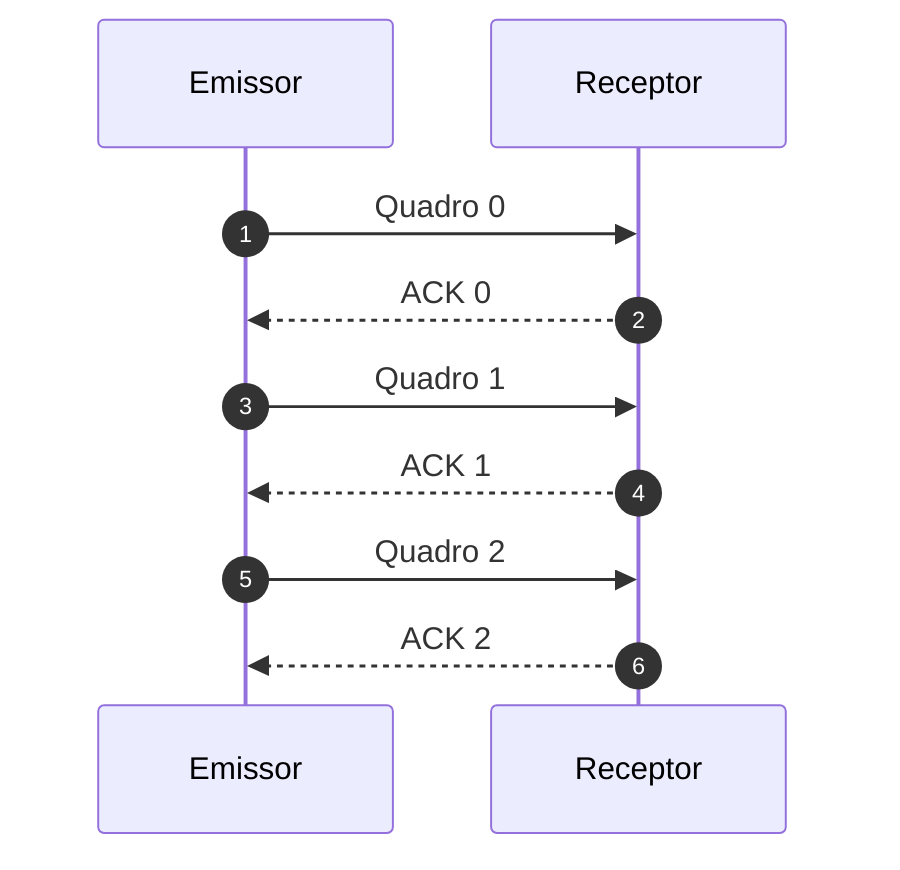
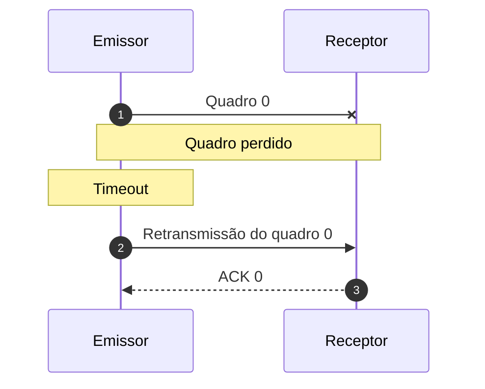
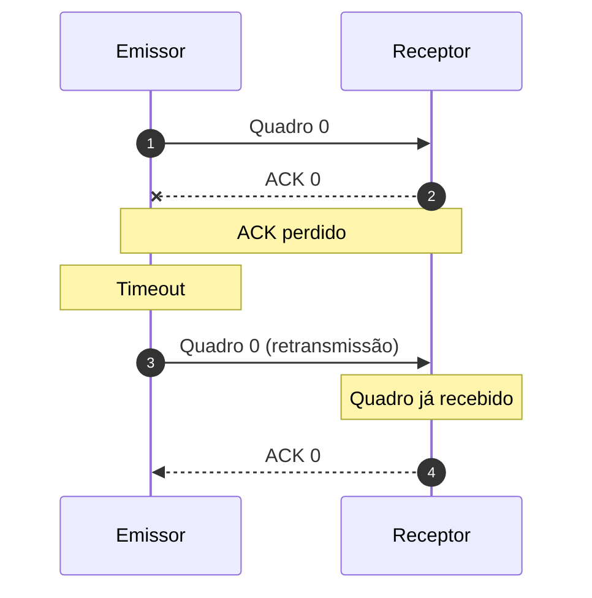

# Stop-and-Wait

## Funcionamento

No **Stop-and-Wait**, o emissor transmite uma unidade de dados e aguarda sua confirmação antes de transmitir a próxima.

Existe, portanto, no máximo uma unidade não confirmada.

## Perda de dados

Se um quadro for perdido, o emissor precisa de um mecanismo para detectar que a confirmação não chegou. Normalmente, isso envolve um **temporizador** e uma retransmissão após o timeout.

## ACK perdido e duplicatas

O quadro pode chegar ao receptor, mas o ACK pode ser perdido. O emissor então retransmite o mesmo quadro. O receptor precisa reconhecer que se trata de uma duplicata.

Por isso, **números de sequência** são fundamentais em protocolos que precisam distinguir dados novos de retransmissões.
