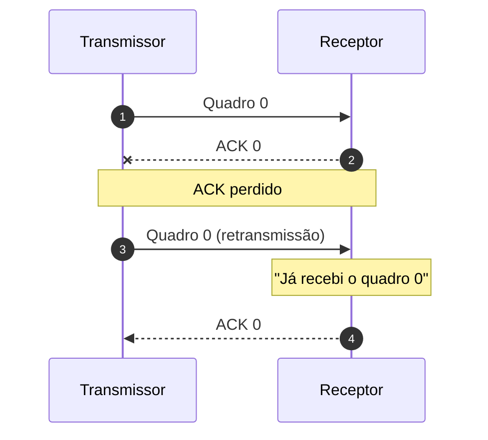

# Números de sequência

As unidades podem receber números de sequência como:

```text
0  1  2  3  4  5  6  ...
```

O número de sequência permite identificar a unidade e ajuda o receptor a reconhecer duplicatas e ordenar dados.


