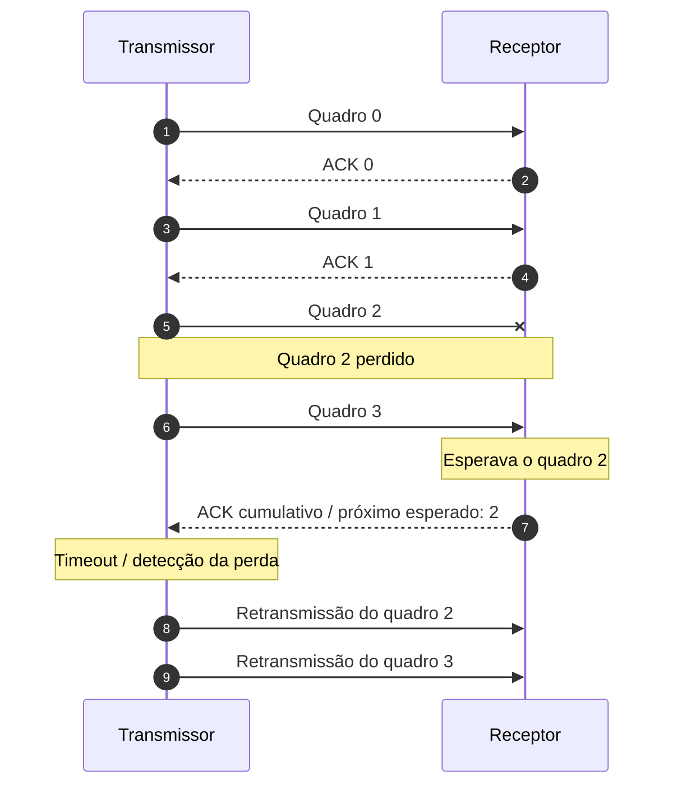

# Go-Back-N

## Ideia geral

No **Go-Back-N (GBN)**, o transmissor pode enviar várias unidades antes de receber confirmações. Quando ocorre uma perda, a recuperação volta ao ponto da falha e reenvia a unidade perdida e as unidades posteriores que precisam ser recuperadas.

Considere:

```text
0: OK
1: OK
2: PERDA
3: PENDENTE
4: PENDENTE
```

Se o quadro 2 for perdido, o receptor não dispõe do quadro esperado para continuar a sequência normalmente.

## Exemplo de perda



O ponto essencial é que o GBN pode retransmitir dados que chegaram ao receptor depois da perda, mas que precisam ser reenviados para recuperar a sequência.

## ACK cumulativo

Um **ACK cumulativo** pode confirmar, de uma só vez, que todas as unidades anteriores a determinado ponto foram recebidas corretamente.

Por exemplo, se o próximo quadro esperado é 5:

```text
0 ✓   1 ✓   2 ✓   3 ✓   4 ✓   5 <= próximo esperado
```

Uma confirmação indicando 5 pode representar o recebimento correto de 0 a 4, conforme a convenção de numeração adotada pelo protocolo.
