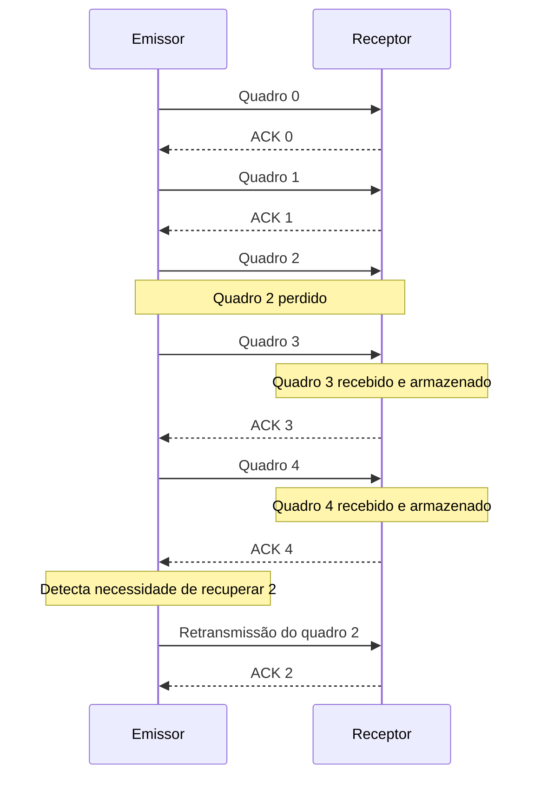

# Repetição Seletiva

## Motivação

No cenário:

```text
0: OK
1: OK
2: PERDA
3: OK
4: OK
```

o receptor já possui 3 e 4. Retransmiti-los seria desnecessário se o protocolo conseguir armazená-los enquanto aguarda o quadro 2.

A **Repetição Seletiva** procura retransmitir somente as unidades que precisam de recuperação.

## Exemplo



Depois de recuperar o quadro 2, o receptor pode integrar os dados que já havia armazenado.
