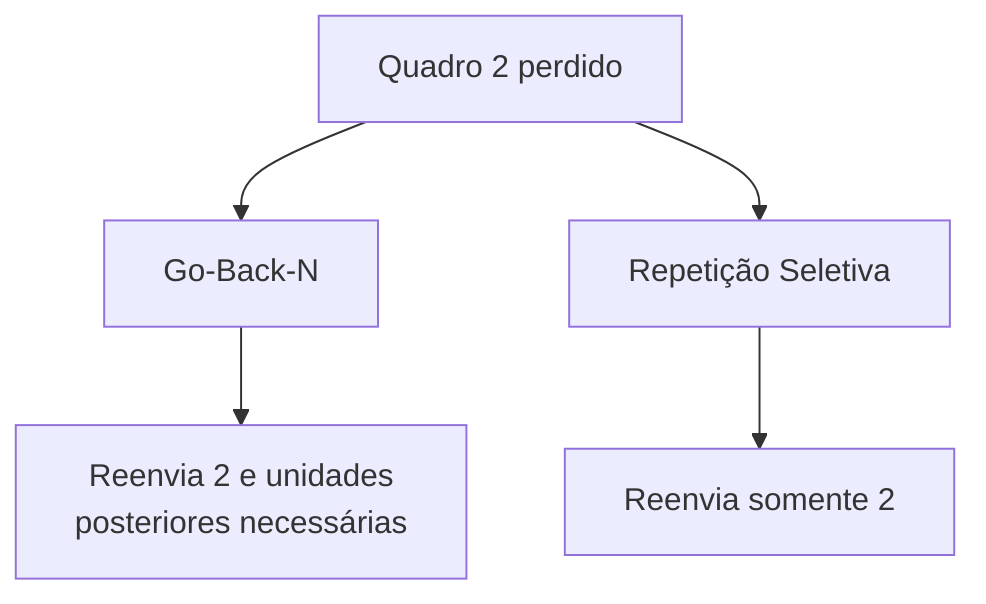

# Go-Back-N × Repetição Seletiva

Considere:

```text
0: OK
1: OK
2: PERDA
3: OK
4: OK
```

No **Go-Back-N**, a perda pode levar à retransmissão de:

```text
2 => 3 => 4
```

Na **Repetição Seletiva**, a recuperação pode ser:

```text
2
```



A vantagem da repetição seletiva é evitar retransmissões desnecessárias. Em contrapartida, ela exige mecanismos mais sofisticados para armazenar e administrar dados recebidos fora de ordem.
