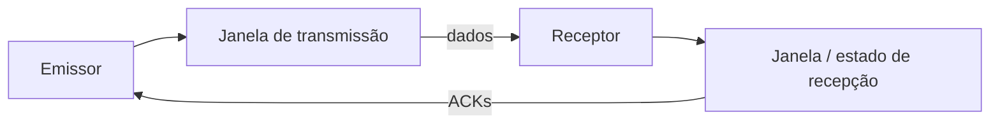

# Janela do emissor e janela do receptor

Uma janela deslizante envolve estado tanto no emissor quanto no receptor.

O emissor precisa saber quais dados:

- já foram confirmados;
- foram enviados, mas ainda aguardam confirmação;
- ainda podem ser enviados.

O receptor precisa saber quais dados:

- já foram recebidos;
- são esperados;
- podem ser armazenados fora de ordem, quando o protocolo permite.

