# Protocolos de Janela Deslizante

## 1. Introdução

Protocolos de **janela deslizante** permitem que um emissor mantenha várias unidades de dados em trânsito antes de receber todas as confirmações correspondentes. A técnica evita que o transmissor permaneça ocioso aguardando uma confirmação após cada transmissão e constitui uma ideia fundamental para compreender confiabilidade, retransmissão e controle de fluxo em redes de computadores.

Neste material, a evolução será apresentada em três etapas:

1. **Stop-and-Wait** — transmite uma unidade e espera sua confirmação;
2. **Go-Back-N (GBN)** — permite várias unidades pendentes, mas uma perda pode provocar a retransmissão da unidade perdida e das posteriores;
3. **Repetição Seletiva (Selective Repeat, SR)** — permite várias unidades pendentes e retransmite somente as unidades que precisam ser recuperadas.

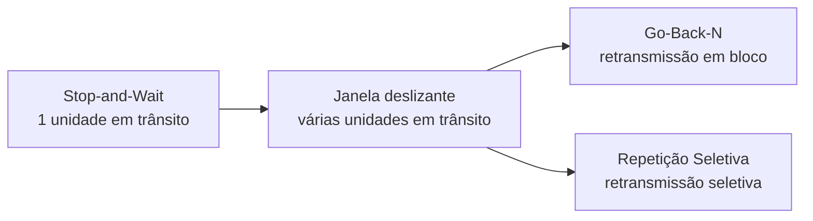

> **Ideia central:** a janela define quantas unidades podem estar simultaneamente em trânsito sem confirmação.

# 2. Por que precisamos de uma janela?

No mecanismo mais simples, o emissor faz:

```text
enviar => esperar ACK => enviar => esperar ACK => ...
```

Se o atraso de propagação for significativo, o transmissor pode passar grande parte do tempo esperando.

Com uma janela, ele pode fazer:

```text
enviar => enviar => enviar => enviar => ...
                 ↑
              ACKs chegam
```

Enquanto as primeiras unidades estão viajando, outras podem ser transmitidas.

Uma janela de tamanho 4 pode ser representada assim:

```text
+----------------+
| 0 | 1 | 2 | 3  |
+----------------+
```

Depois que 0 e 1 são confirmados, a janela avança:

```text
 0   1   +---+---+---+---+   6   7
         | 2 | 3 | 4 | 5 |
         +---+---+---+---+
           <--- janela --->
```

É esse deslocamento que dá origem ao termo **janela deslizante**.

# 3. Stop-and-Wait

## 3.1 Funcionamento

No **Stop-and-Wait**, o emissor transmite uma unidade de dados e aguarda sua confirmação antes de transmitir a próxima.

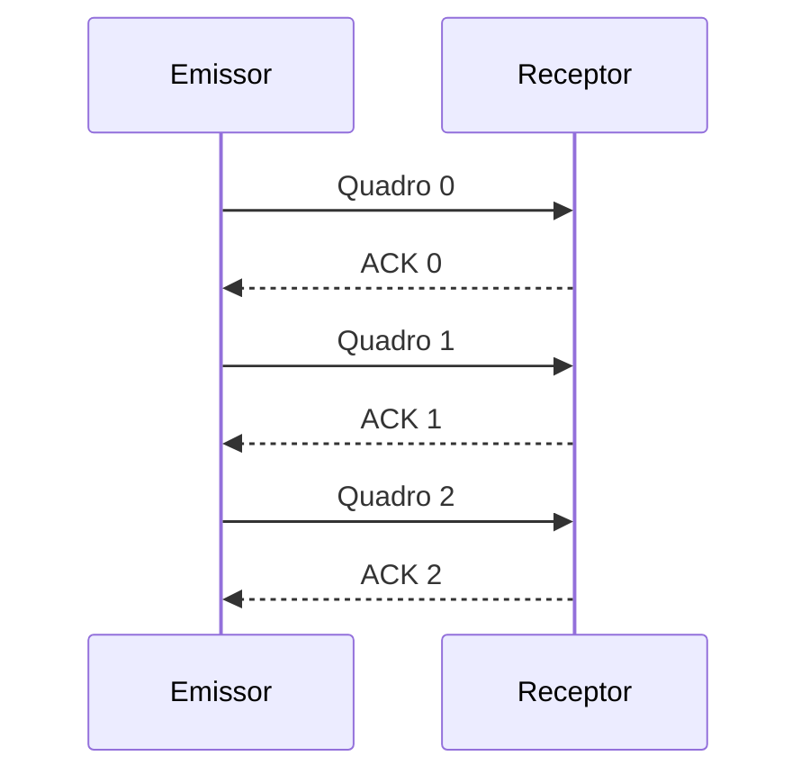

Existe, portanto, no máximo uma unidade não confirmada.

## 3.2 Perda de dados

Se um quadro for perdido, o emissor precisa de um mecanismo para detectar que a confirmação não chegou. Normalmente, isso envolve um **temporizador** e uma retransmissão após o timeout.

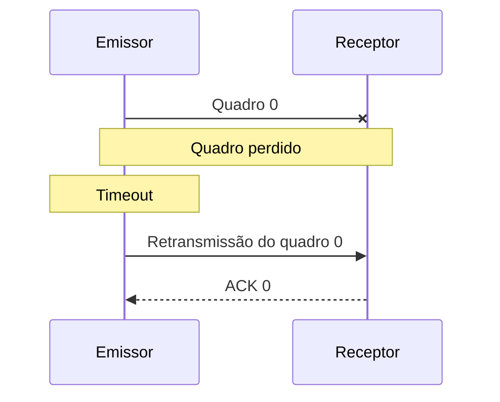

## 3.3 ACK perdido e duplicatas

O quadro pode chegar ao receptor, mas o ACK pode ser perdido. O emissor então retransmite o mesmo quadro. O receptor precisa reconhecer que se trata de uma duplicata.

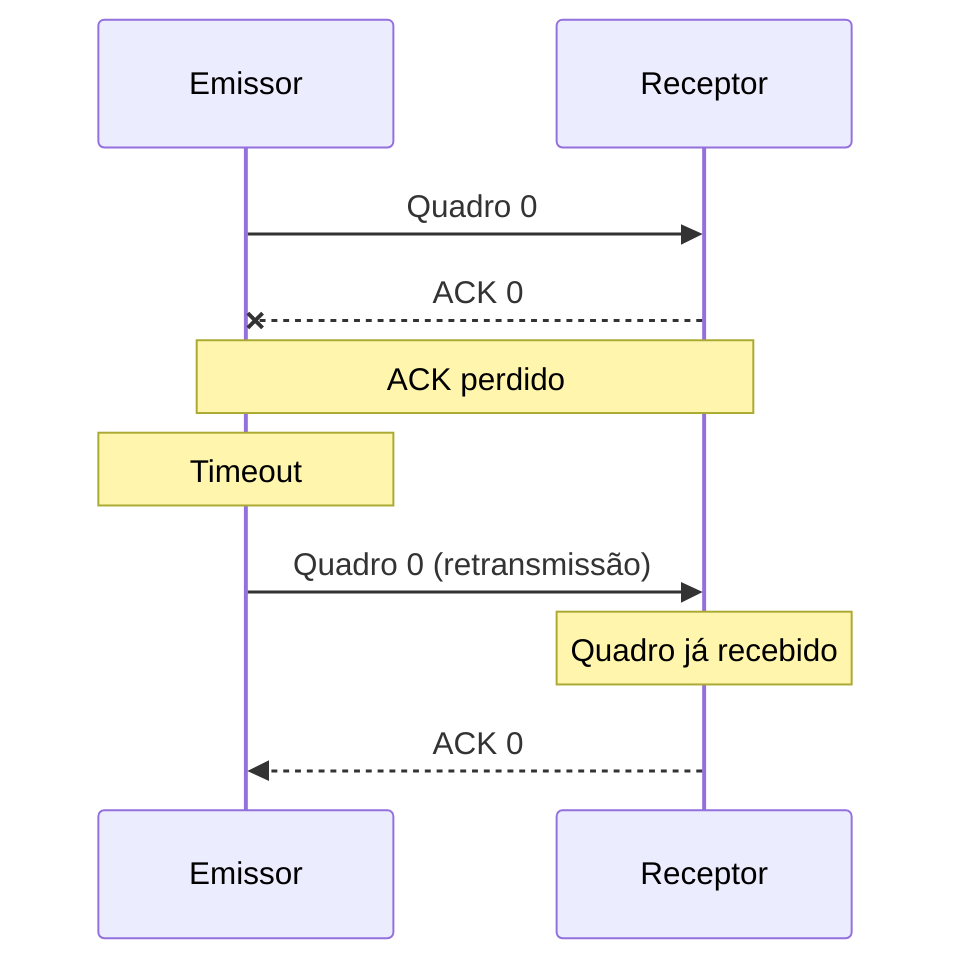

Por isso, **números de sequência** são fundamentais em protocolos que precisam distinguir dados novos de retransmissões.

# 4. Números de sequência

As unidades podem receber números de sequência como:

```text
0  1  2  3  4  5  6  ...
```

O número de sequência permite identificar a unidade e ajuda o receptor a reconhecer duplicatas e ordenar dados.

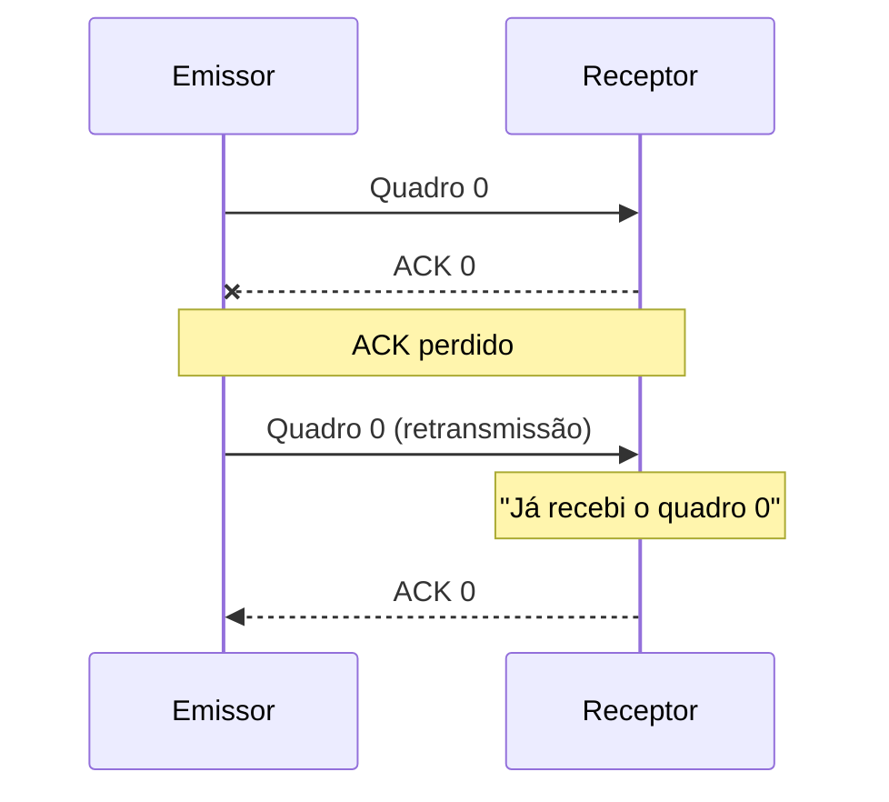

# 5. Da espera à janela deslizante

A janela generaliza o Stop-and-Wait: em vez de permitir somente uma unidade não confirmada, o emissor pode manter várias.

```text
Antes:

    +---------------+
    | 0 | 1 | 2 | 3 |
    +---------------+

Depois de confirmar 0 e 1:

      0   1   +---+---+---+---+   6   7
              | 2 | 3 | 4 | 5 |
              +---+---+---+---+
              <--- janela ---->
```

A janela contém, conceitualmente, os números de sequência que estão dentro do espaço de transmissão permitido naquele momento.

# 6. Go-Back-N

## 6.1 Ideia geral

No **Go-Back-N (GBN)**, o emissor pode enviar várias unidades antes de receber confirmações. Quando ocorre uma perda, a recuperação volta ao ponto da falha e retransmite a unidade perdida e as unidades posteriores que precisam ser recuperadas.

Considere:

```text
0 ✓
1 ✓
2 ✗
3 ?
4 ?
```

Se o quadro 2 for perdido, o receptor não dispõe do quadro esperado para continuar a sequência normalmente.

## 6.2 Exemplo de perda

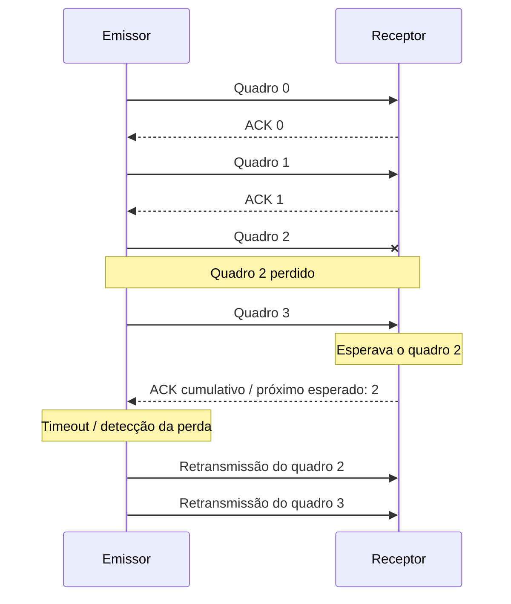

O ponto essencial é que o GBN pode retransmitir dados que chegaram ao receptor depois da perda, mas que precisam ser reenviados para recuperar a sequência.

## 6.3 ACK cumulativo

Um **ACK cumulativo** pode confirmar, de uma só vez, que todas as unidades anteriores a determinado ponto foram recebidas corretamente.

Por exemplo, se o próximo quadro esperado é 5:

```text
0 ✓   1 ✓   2 ✓   3 ✓   4 ✓   5 <= próximo esperado
```

Uma confirmação indicando 5 pode representar o recebimento correto de 0 a 4, conforme a convenção de numeração adotada pelo protocolo.

# 7. Repetição Seletiva

## 7.1 Motivação

No cenário:

```text
0 ✓
1 ✓
2 ✗
3 ✓
4 ✓
```

o receptor já possui 3 e 4. Retransmiti-los seria desnecessário se o protocolo conseguir armazená-los enquanto aguarda o quadro 2.

A **Repetição Seletiva** procura retransmitir somente as unidades que precisam de recuperação.

## 7.2 Exemplo

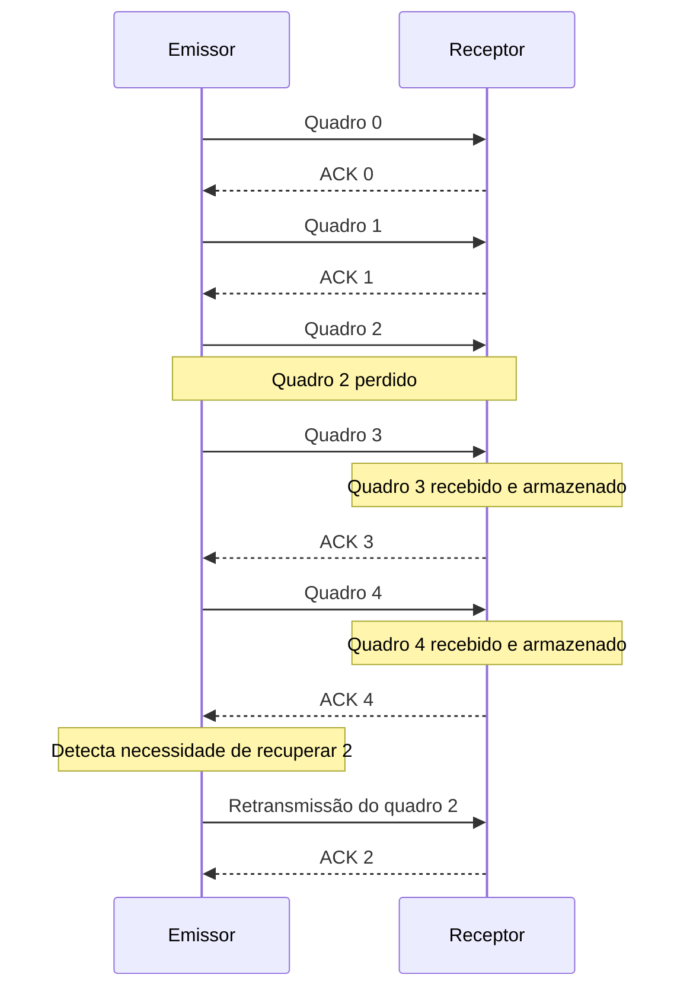

Depois de recuperar o quadro 2, o receptor pode integrar os dados que já havia armazenado.

# 8. Go-Back-N × Repetição Seletiva

Considere:

```text
0 ✓
1 ✓
2 ✗
3 ✓
4 ✓
```

No **Go-Back-N**, a perda pode levar à retransmissão de:

```text
2 => 3 => 4
```

Na **Repetição Seletiva**, a recuperação pode ser:

```text
2
```

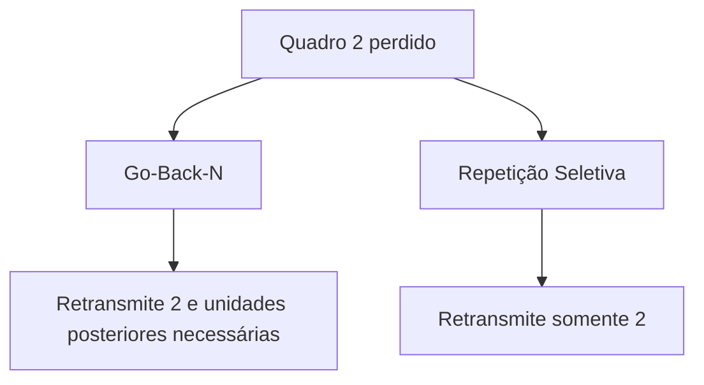

A vantagem da repetição seletiva é evitar retransmissões desnecessárias. Em contrapartida, ela exige mecanismos mais sofisticados para armazenar e administrar dados recebidos fora de ordem.

# 9. Janela do emissor e janela do receptor

Uma janela deslizante envolve estado tanto no emissor quanto no receptor.

O emissor precisa saber quais dados:

- já foram confirmados;
- foram enviados, mas ainda aguardam confirmação;
- ainda podem ser enviados.

O receptor precisa saber quais dados:

- já foram recebidos;
- são esperados;
- podem ser armazenados fora de ordem, quando o protocolo permite.

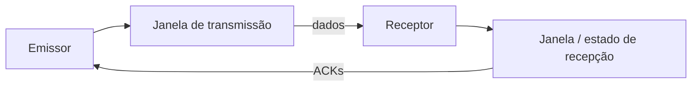

# 10. Relação com eficiência do enlace

Considere um enlace no qual o tempo de ida e volta é grande em relação ao tempo necessário para transmitir um quadro.

Stop-and-Wait:

```text
[TX]──────►
      ◄────ACK
[TX]──────►
      ◄────ACK
```

Janela deslizante:

```text
[TX]────►
   [TX]────►
      [TX]────►
         [TX]────►
              ◄──ACK
```

A segunda estratégia permite sobrepor transmissão e espera por confirmações, mantendo mais dados em trânsito.

# 11. Relação com controle de fluxo

A ideia de janela também aparece no **controle de fluxo**. O receptor pode limitar a quantidade de dados que o emissor mantém em trânsito para evitar que seus buffers sejam excedidos.

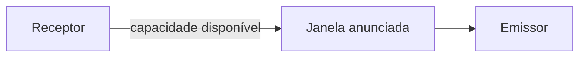

No TCP, a janela de recepção é representada conceitualmente por **`rwnd`**. Ela expressa uma limitação associada à capacidade do receptor.

# 12. Relação com controle de congestionamento

No TCP existe outra limitação importante: a rede pode não suportar uma quantidade arbitrariamente grande de dados em trânsito. O controle de congestionamento utiliza **`cwnd`** para limitar a quantidade de dados que o emissor coloca na rede em função das condições de congestionamento.

Uma visão conceitual simplificada é:

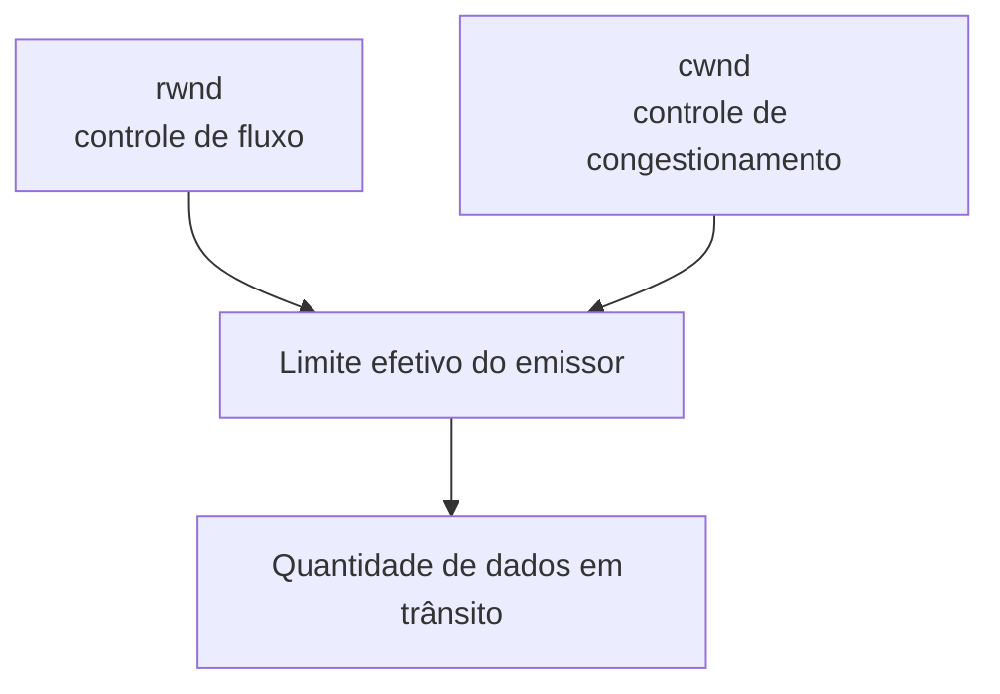

> **Atenção:** `rwnd` e `cwnd` têm funções diferentes. O primeiro está relacionado ao receptor; o segundo, às condições da rede.

# 13. Relação com o TCP

O estudo de Stop-and-Wait, Go-Back-N e Repetição Seletiva fornece uma base conceitual para compreender números de sequência, ACKs, retransmissões, temporizadores e janelas.

Entretanto, **não é correto simplesmente classificar o TCP como Go-Back-N ou como Repetição Seletiva**. O TCP possui mecanismos próprios e combina controle de fluxo, retransmissão e controle de congestionamento.

A RFC 9293 especifica o TCP como um serviço confiável e ordenado de **fluxo de bytes**. Portanto, o modelo didático dos protocolos de janela deve ser usado para compreender princípios, e não como uma identificação literal do TCP com um desses protocolos.

# 14. Comparação

| Característica | Stop-and-Wait | Go-Back-N | Repetição Seletiva |
| --- | --- | --- | --- |
| Unidades simultaneamente em trânsito | 1 | Várias | Várias |
| Janela | Efetivamente 1 | Sim | Sim |
| Recuperação de perda | Unidade pendente | Perda e posteriores necessários | Somente unidades necessárias |
| Recepção fora de ordem | Não é necessária | Geralmente não aproveitada | Pode ser armazenada |
| Complexidade | Baixa | Intermediária | Maior |
| Armazenamento no receptor | Pequeno | Menor | Maior |

A evolução pode ser resumida assim:

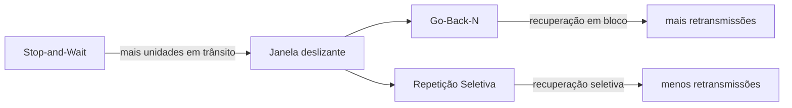

# 15. Analogia

Imagine um professor entregando exercícios numerados.

### Stop-and-Wait

```text
Professor => Exercício 1 => Aluno
Professor <= "Recebi" <= Aluno
Professor => Exercício 2 => Aluno
```

### Go-Back-N

O professor pode entregar vários:

```text
1 => 2 => 3 => 4 => 5
```

Se o exercício 3 não chegar, ele volta ao ponto da falha:

```text
3 => 4 => 5
```

### Repetição Seletiva

Se 4 e 5 já chegaram, mas 3 não:

```text
3
```

é suficiente para recuperar a lacuna, desde que o aluno possa guardar 4 e 5 temporariamente.

# 16. Exercício de aplicação

Considere:

```text
0 ✓
1 ✓
2 ✗
3 ✓
4 ✓
5 ✓
```

Responda:

1. Como o Stop-and-Wait trataria a perda?
2. Quais unidades poderiam ser retransmitidas no Go-Back-N?
3. Qual unidade seria suficiente para recuperação na Repetição Seletiva?
4. Por que uma janela maior pode melhorar a utilização de um enlace com grande atraso?
5. Qual protocolo exige maior capacidade de armazenamento para preservar dados recebidos fora de ordem?
6. Qual é a diferença entre `rwnd` e `cwnd` no TCP?
7. Por que não se deve afirmar simplesmente que TCP é Go-Back-N?

# 17. Síntese

A ideia fundamental da janela deslizante é permitir que **várias unidades de dados permaneçam em trânsito simultaneamente**, em vez de interromper a transmissão depois de cada unidade.

O **Stop-and-Wait** representa o caso mais simples: uma unidade é transmitida e o emissor aguarda sua confirmação.

O **Go-Back-N** amplia o paralelismo, mas pode precisar retransmitir a unidade perdida e unidades posteriores.

A **Repetição Seletiva** permite uma recuperação mais seletiva: unidades recebidas corretamente podem ser preservadas, enquanto somente as que precisam de retransmissão são reenviadas.

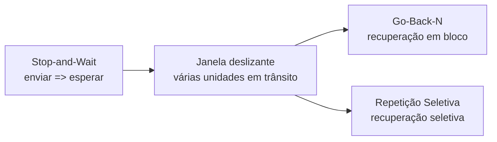

Esses mecanismos formam uma base conceitual para compreender **confiabilidade, confirmação, retransmissão, controle de fluxo e operação de protocolos de transporte**.

# 18. Referências

- POSTEL, J. **Reliable Data Transmission** e mecanismos relacionados à ARQ e controle de sequência, conforme a literatura clássica de redes de computadores.
- KUROSE, J. F.; ROSS, K. W. *Computer Networking: A Top-Down Approach*. Pearson.
- TANENBAUM, A. S.; FEAMSTER, N.; WETHERALL, D. J. *Computer Networks*. Pearson.
- IETF. **RFC 9293 — Transmission Control Protocol (TCP)**. RFC Editor.
- IETF. **RFC 5681 — TCP Congestion Control**. RFC Editor.
